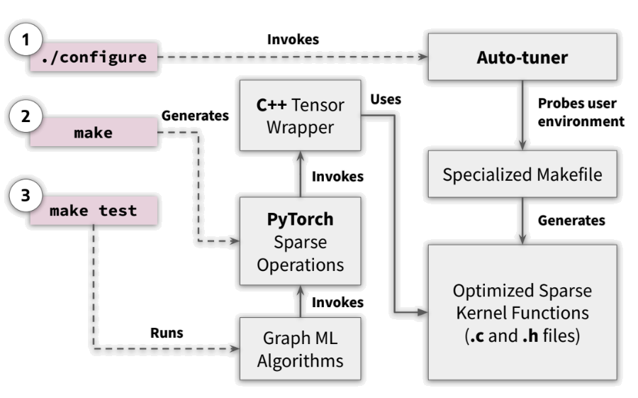

# iSpLib - An Intelligent Sparse Library


iSpLib is an accelerated sparse kernel library with PyTorch interface. This library has an auto-tuner which generates optimized custom sparse kernels based on the user environment. The goal of this library is to provide efficient sparse operations for Graph Neural Network implementations. Currently it has support for CPU-based efficient Sparse Dense Matrix Multiplication (spmm-sum only) with autograd.

<p align="center"></p>

## Installation

To install the package, run the following commands:

- `git clone --recursive https://github.com/HipGraph/iSpLib.git`: To clone this repository. This library has a dependency, therfore `--recursive` flag is needed to download the third-party repository.
- `./configure`: To download and run the auto-tuner. This is a pre-requisite for the installation.
- `make`: To install the library.

## Performance and Testing

When compared to PyTorch Sparse, a 2-layer GCN implemention with 10 epochs is-

- **2.57x** faster on Cora dataset
- **2.05x** faster on Reddit dataset

To run the test code, use the command: `make test`. This runs the python script in `tests/GCN.py` and prints out the speed-up along with the accuracy.

### Example 

The SpMM operation can also be used directly. Following is an example of a sparse and dense matrix multiplication:

```
import builtins
from isplib.matmul import *
from isplib.tensor import SparseTensor
from scipy.sparse import coo_matrix
import torch 

index = torch.tensor([[0, 0, 1, 2, 2],
                      [0, 2, 1, 0, 1]])
value = torch.Tensor([1, 2, 4, 1, 3])
matrix = torch.Tensor([[90, 4], [2, 5], [3, 6]])

a = SparseTensor.from_scipy(coo_matrix((value, index), shape=(3, 3)))
b = matrix
builtins.FUSEDMM = True
print(spmm_sum(a, b))
```
