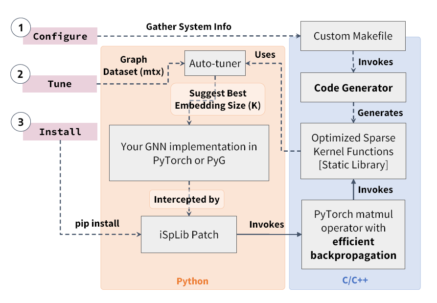

This is the official implementation of the iSpLib library accepted for publication in Companion Proceedings of the ACM on Web Conference 2024 titled "iSpLib: A Library for Accelerating Graph Neural Networks using Auto-tuned Sparse Operations". [PDF](https://arxiv.org/pdf/2403.14853)

# iSpLib - An Intelligent Sparse Library

iSpLib is an accelerated sparse kernel library with a PyTorch interface. This library has an auto-tuner that generates optimized custom sparse kernels based on the user environment. The goal of this library is to provide efficient sparse operations for Graph Neural Network implementations. Currently, it has support for CPU-based efficient Sparse Dense Matrix Multiplication (SpMM sum, mean, max, min) with autograd in Linux environment.

<p align="center"></p>

## System Requirements

Users need to have the following software/tools installed in their PC/server. The source code was compiled and run successfully in Linux (Ubuntu and Centos distributions).

```
Make >= 4.4
GCC >= 10.1 (Support for C++ >= 14)
OpenMP >= 4.5
Python >= 3.7
PyTorch >= 2.0
torch-scatter torch-sparse [PyTorch compatible] 
```

### Python Environment Setup

**It is recommended to create a virtual environment**

Torch-sparse and torch-scatter should be compatible with current PyTorch version.

```
import torch
print(torch.__version__)
!pip install torch-scatter torch-sparse -f https://data.pyg.org/whl/torch-{torch.__version__}.html
```

## Installation

To install the iSpLib package, use the follwing steps:

```
git clone https://github.com/HipGraph/iSpLib.git
cd iSpLib
./configure
make
```

## Testing
To test the average training time of iSpLib on a 2-layer GCN for Reddit dataset, run:

```
cd ./tests/cpu/
python gcn-sparse.py reddit isplib
```

- Supported datasets in the first argument: `amazon reddit protein reddit2 product mag`. 
- Supported frameworks in the second argument: `pt2 pt1 isplib`.
- Supported GNNs: gcn-\*.py, graphSAGE-\*.py, gin-\*.py (To see how to run, see at the top of each file)
- For PT2-MP and PT2-Compile please use \*-compile.py instead of \*-sparse.py.

## PyTorch Geometric Patch
[Tested on PyG 2.4.0 and PyTorch 2.1]

If you have an existing PyG implementation of a GNN that uses SpMM (i.e., the dataset is in SparseTensor format), you can use iSpLib patch function to divert SpMM calls to iSpLib. 

**Make sure to convert your PyG dataset into TorchSparse format**

To patch, use the following two lines at the top of your implementation:

```
from isplib import * 
iSpLibPlugin.patch_pyg()

# beginning of the rest of your PyG code

```

To unpatch, use `iSpLibPlugin.unpatch_pyg()` at any point of your code after patching. You can also use the decorator function `@isplib_autotune` to patch a specific function instead.

### Example code to convert PyG dataset into TorchSparse format:
```
from torch_geometric.datasets import Reddit
import torch_geometric.transforms as T

dataset = Reddit(root='path/to/reddit', transform=T.ToSparseTensor())
```

## Standalone Matmul Function

You can also use the standalone SpMM (matmul) function from iSpLib. The best way to use it is through the torch_sparse's matmul function.

Example code to use matmul (SpMM):
```
import torch
# print(torch.__version__)
!pip install torch-scatter torch-sparse -f https://data.pyg.org/whl/torch-{torch.__version__}.html

from isplib import * 
iSpLibPlugin.patch_pyg()
import torch_sparse
from torch_sparse import SparseTensor

# adj_t
# tensor([[-2,  0,  2],
#         [ 4,  0,  0],
#         [ 0,  3,  0]])

adj_t = SparseTensor(
    row=torch.tensor([2, 0, 1, 0, 0], dtype=torch.int64),
    col=torch.tensor([1, 0, 0, 2, 0], dtype=torch.int64),
    value=torch.tensor([3, 3, 4, 2, -2], dtype=torch.float32),
    sparse_sizes=(3, 3)
)

# tensor([[1, 0, 2],
#         [4, 0, 0],
#         [0, 3, 0]])

dense = torch.tensor([[1, 0, 2], [4, 0, 0], [0, 3, 0]], dtype=torch.float32)

torch_sparse.matmul(adj_t, dense)

# adj_t = Sparse Matrix in SparseTensor format from torch_sparse
# dense = Dense Matrix, 2-d PyTorch tensor
# aggr = 'sum', 'mean', 'max', or 'min'; default = 'sum'
# Type of index= int64, Type of value = float32

```

## Autotuning

iSpLib's autotuner can suggest the best possible embedding size (K value) for your graph dataset. You will need to have your graph's adj_matrix in mtx format. In order to perform autotuning, use the following commands:

```
cd autotuner
git clone https://github.com/HipGraph/FusedMM.git
cd FusedMM/
./configure
make
# Now copy your dataset mtx file into ./autotuner/FusedMM/dataset/ folder
cp ../findbestk.py ./test/
cd ./test
python findbestk.py your_mtx_filename_without_dot_mtx_at_the_end > autotune.txt
```
The autotune.txt will be generated with a table showing the speedups for different embedding sizes (K). You can choose the best K based on the highest speedup. You can also modify the K values to tune in the findbestk.py file.

### Converting a PyG dataset to mtx format 
In order to generate tuning graph, first convert your graph's adj_matrix into mtx format. 

Sample code to generate mtx file:
```
# A fast mtx generater:
# !pip install fast_matrix_market


import scipy.sparse as sparse
import fast_matrix_market as fmm

# Here dataset is a PyG dataset with SparseTensor. 
# See above section for example conversion code.
def dataset_to_mtx(dataset, filename):
    coo = dataset.adj_t.to_torch_sparse_coo_tensor()
    coo = coo.coalesce()
    i = coo.indices()[0] 
    j = coo.indices()[1]
    v = coo.values()
    shape = coo.size()
    coo_sci = sparse.coo_matrix((v,(i,j)),shape=(shape[0], shape[1]))
    fmm.mmwrite(filename,coo_sci)

dataset_to_mtx(your_pyg_dataset, "your_dataset.mtx")
```

## Troubleshoot

- If `make` command exits with unknown error message, try running `pip3 install -e .` instead.
- Common installation errors can be avoided by making sure that PyTorch version is compatible with current CUDA version (if any).
- If you are facing an error that says "symbol not found...", most probably the error is due to a mismatch between PyTorch version and CUDA (or Torch Sparse).
- If you are facing an error that says "allow_pickle...", the dataset is corrupted. You'll need to manually download the datasets by clicking the links shown in console and put them into raw/ folder.

## Performance and Testing

We observed significant performance improvements when iSpLib was integrated with PyG 2.4.0, resulting in a GNN training speedup of up to 27x for GCN, 12x for GraphSAGE-sum, 8x for GraphSAGE-mean, and 18x for Graph Isomorphism Network (GIN).

## Bug Report/Comments

iSpLib is an ongoing project and the functionalities are still experimental. Please share your comments/report bugs at mdshoque AT iu DOT edu.

## Citation

If you find this repository helpful, please cite the following paper:

    @inproceedings{hoque2024isplib,
      title={iSpLib: A Library for Accelerating Graph Neural Networks using Auto-tuned Sparse Operations},
      author={Hoque Anik, Md Saidul and Badhe, Pranav and Gampa, Rohit and Azad, Ariful},
      booktitle={Companion Proceedings of the ACM on Web Conference 2024},
      pages={778--781},
      year={2024}
    }

## License
iSpLib is licensed under the https://opensource.org/licenses/BSD-3-Clause

# Acknowledgements

*This work has been funded by grants from the National Science Foundation, including the ICICLE AI Institute (OAC 2112606)*

We extend our appreciation to the PyTorch_Sparse community for open-sourcing their project. Our project has significantly benefited from their coding style and implementation.
